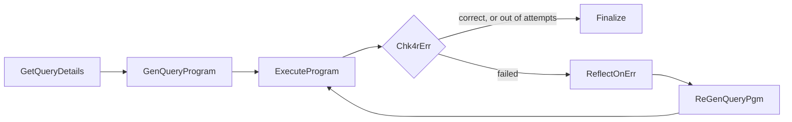

# Self-correcting code generation with LangGraph

A LangGraph agent that answers a natural-language data query by **writing a Python program**, running it, and
**reflecting on its own failures** until the program produces a correct answer.

Given a query and descriptions of some CSV files, the agent:

1. asks an LLM (Azure OpenAI) to write a standalone program that prints a JSON answer,
2. runs the program in a subprocess (60 s timeout),
3. checks the output is valid JSON and passes a user-supplied validator,
4. on any failure, asks the LLM to *diagnose* the error, then regenerates the program using that diagnosis
   (up to 5 attempts in total).



Nothing is specific to the sample query: the query name, data files and validator are all discovered from the
input files, so the same graph works for other queries over similarly formatted data.

## Layout

```
hw2.py              entry point
codegen/
  graph.py          graph wiring and routing
  nodes.py          the graph nodes
  prompts.py        generation / reflection / regeneration prompts
  llm.py            Azure OpenAI client, code-fence stripping
  query_spec.py     parses query_input.txt
  executor.py       runs a generated program, parses its JSON output
  validation.py     loads and calls the query's validator
  output.py         writes the four result files
  config.py         model, retry limit, timeout
  state.py          graph state
sample_data/        sample query, CSVs and validator (from the course)
examples/           output from a successful run on the sample query
tests/              unit tests + end-to-end graph runs with a fake LLM
```

## Running it

```bash
python -m venv .venv && source .venv/bin/activate
pip install -r requirements.txt
export AZURE_OPENAI_API_KEY=...        # see .env.example

cd sample_data
python ../hw2.py
```

The agent reads and writes in the current directory. For a query named `top-spender` it expects
`query_input.txt`, `top-spender.txt`, the data files and `top_spender_validate.py`, and produces
`top-spender.py`, `top-spender_answer.txt`, `top-spender_errors.txt` and `top-spender_reflect.txt`.
On the sample data the correct answer is
`{"FirstName": "Oren", "LastName": "Levi", "City": "Haifa", "TotalSpent": 572.47}`.

## Tests

```bash
pip install pytest
pytest
```

The graph tests replace the LLM with a scripted fake, so they need no API key and exercise the success,
reflect-and-recover and give-up paths.
