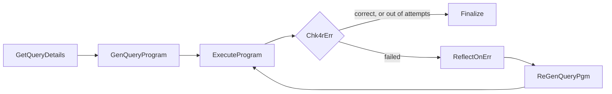

# Self-correcting code generation with LangGraph

A LangGraph agent that answers a natural-language question about CSV data by **writing a Python program**,
**running it**, **checking the result**, and **reflecting on its own failures** until the program produces a
correct answer.

## The idea

Asking an LLM to answer a data question directly is unreliable: it can't see the whole dataset, and it does
arithmetic and aggregation poorly. Asking it to *write code* that computes the answer works much better, but
first-draft code often has bugs: a wrong column name, a bad join, a crash, extra text printed next to the JSON,
or a program that runs fine and returns the wrong number.

This project closes that loop. Instead of trusting the first program, the agent treats the LLM like a developer
who gets feedback: it runs the code, sees what went wrong (a stack trace, a timeout, malformed output, or a
failed correctness check), writes a diagnosis of the mistake, and tries again with that diagnosis in hand.

## What it does, step by step

Given a query (plain text) and a description of each data file, the agent:

1. **Reads the task.** `query_input.txt` names the query and lists the data files with a description of their
   columns. The query text itself lives in `<query-name>.txt`.
2. **Generates a program.** It prompts an LLM (Azure OpenAI) to write a complete, standalone Python program.
   The prompt forbids debug output and file writes, and requires the program to print a single JSON object
   containing exactly the fields the query asks for.
3. **Executes it.** The program is saved as `<query-name>.py` and run in a separate subprocess with a 60 second
   timeout, so a crash or infinite loop in generated code cannot take down the agent.
4. **Checks the result.** Four things can fail, and each produces a distinct, descriptive error message:
   - the process crashes (the stderr traceback becomes the error),
   - the process times out,
   - the output isn't a non-empty JSON object (the raw stdout is echoed back so the LLM can see what it printed),
   - the output is valid JSON but the query's **validator** function rejects it (the wrong answer is included
     in the error message).
5. **Reflects.** On failure, a separate LLM call is asked to *only diagnose*, not write code: what caused the
   error and what needs to change. Separating diagnosis from rewriting makes the model reason about the bug
   before it patches it.
6. **Regenerates.** A third prompt gives the LLM the query, the data descriptions, the failed program and the
   diagnosis, and asks for a corrected program. The loop returns to step 3.
7. **Finalizes.** The loop ends when an answer passes validation or when the attempt limit is reached
   (5 attempts in total). Either way, the result is written to disk (see [Output files](#output-files)).



| Node | Responsibility |
|---|---|
| `GetQueryDetails` | Parse `query_input.txt`, read the query text, work out the validator's name, build the initial state. |
| `GenQueryProgram` | First LLM call: query + data descriptions → program. |
| `ExecuteProgram` | Write the program to disk, run it, parse its JSON output, call the validator. |
| `Chk4rErr` | Routing point: stop on success or when attempts run out, otherwise go reflect. |
| `ReflectOnErr` | Second LLM call: original prompt + failed program + error → written diagnosis. |
| `ReGenQueryPgm` | Third LLM call: query + failed program + diagnosis → new program; increments the attempt counter. |
| `Finalize` | Write the four output files and print the outcome. |

### Details worth knowing

- **Validator-driven correctness.** "It ran without errors" is not "it's right". The agent dynamically loads a
  per-query validator module and calls its function on the program's output. A `False` result is turned into an
  error (including the incorrect output) and sent through the same reflect-and-regenerate loop as a crash.
- **Content-filter resilience.** Azure can reject a request with a content-filter error. The agent catches it,
  records it as the current error, and carries on through the retry loop (with a neutral rewording hint for the
  reflection step) instead of crashing.
- **Markdown fences are stripped.** LLMs often wrap code in <code>```python</code> fences; they're removed
  before the program is saved.
- **Deterministic sampling.** Temperature is 0, so runs are as repeatable as the model allows.
- **Nothing is specific to the sample query.** The query name, data files and validator are all discovered from
  the input files, so the same graph handles other queries over similarly formatted data. Hyphens in the query
  name become underscores for the validator: `top-spender` → `top_spender_validate.py` with function
  `top_spender_answer`.

## The sample query

The bundled example in `sample_data/` asks:

> Find the customer who spent the most money in total, considering only orders with status "Delivered". The
> total spent is the sum of (Quantity × Price) over delivered orders, joining orders with products on ProductID.
> Return FirstName, LastName, City and TotalSpent, rounded to 2 decimal places.

It runs over three CSVs (`customers.csv`, `orders.csv`, `products.csv`), which is a join, a filter, a group-by
and an arg-max, exactly the kind of multi-step logic where a first attempt can go subtly wrong. The correct
answer is:

```json
{"FirstName": "Oren", "LastName": "Levi", "City": "Haifa", "TotalSpent": 572.47}
```

`examples/top-spender/` contains the output of a successful run, including the generated pandas program.

## Input files

Run the agent from a directory containing:

| File | Purpose |
|---|---|
| `query_input.txt` | First line `query_name:<name>`, then one `data_file:` / `description:` pair per CSV. |
| `<name>.txt` | The natural-language query. |
| the data files | The CSVs named in `query_input.txt`. |
| `<name with _>_validate.py` | Defines `<name with _>_answer(answer) -> bool`, returning `True` only for a correct answer. |

`query_input.txt` from the sample:

```
query_name:top-spender
data_file: customers.csv
description: This csv file contains customer information. Each line is of the form: CustomerID,FirstName,LastName,City,Country
data_file: orders.csv
description: ...
```

## Output files

For a query named `top-spender`:

| File | On success | On failure |
|---|---|---|
| `top-spender.py` | the final generated program | the last attempted program |
| `top-spender_answer.txt` | the answer as JSON | empty |
| `top-spender_errors.txt` | empty | the last error |
| `top-spender_reflect.txt` | empty | the last diagnosis |

## Layout

```
hw2.py              entry point
codegen/
  graph.py          graph wiring and routing
  nodes.py          the graph nodes
  prompts.py        generation / reflection / regeneration prompts
  llm.py            Azure OpenAI client, code-fence stripping
  query_spec.py     parses query_input.txt
  executor.py       runs a generated program, parses its JSON output
  validation.py     loads and calls the query's validator
  output.py         writes the four result files
  config.py         model, retry limit, timeout
  state.py          graph state
sample_data/        sample query, CSVs and validator (from the course)
examples/           output from a successful run on the sample query
tests/              unit tests + end-to-end graph runs with a fake LLM
```

## Running it

```bash
python -m venv .venv && source .venv/bin/activate
pip install -r requirements.txt
export AZURE_OPENAI_API_KEY=...        # see .env.example

cd sample_data
python ../hw2.py
```

The agent reads and writes in the current directory. Model, endpoint, attempt limit (`MAX_ITERATION`) and
subprocess timeout are set in `codegen/config.py`. Generated programs use `pandas` or `csv`, so pandas must be
installed in the environment that runs them (it is in `requirements.txt`).

## Tests

```bash
pip install pytest
pytest
```

The graph tests replace the LLM with a scripted fake, so they need no API key. They cover the success,
reflect-and-recover, and give-up paths end to end; the unit tests cover input parsing, validator naming,
code-fence stripping, and the executor's handling of success, crashes and invalid JSON.

## Limitations

- Generated code runs as a plain subprocess with the user's permissions: there is no sandbox, so only run it
  on data and queries you trust.
- Correctness is only as good as the validator you supply; without one there is nothing to catch a wrong but
  well-formed answer.
- Output is expected to be a single flat JSON object.
